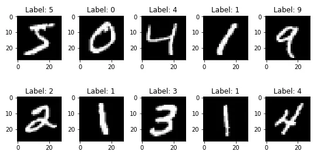
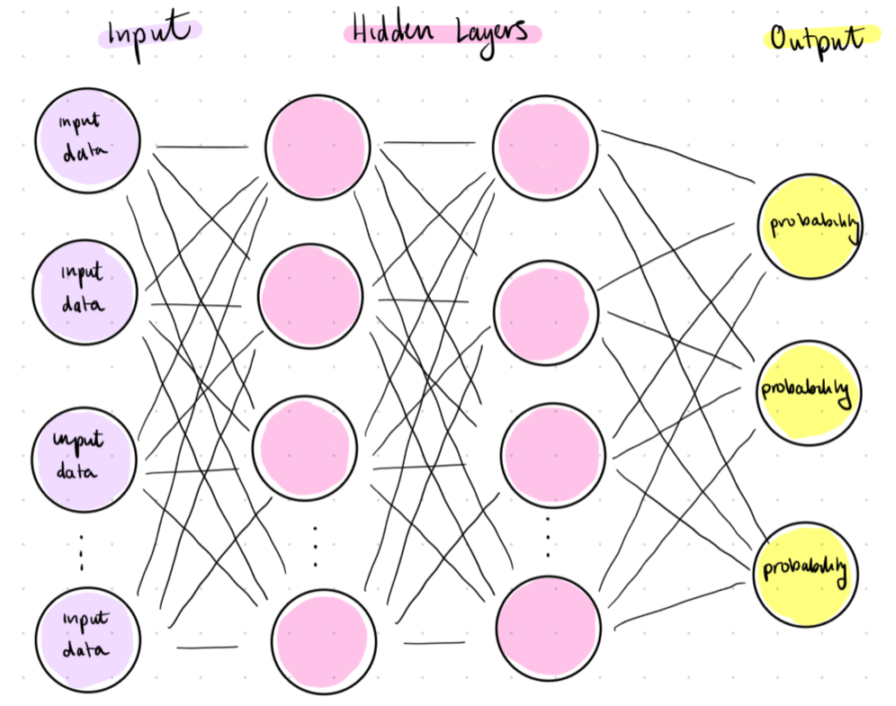
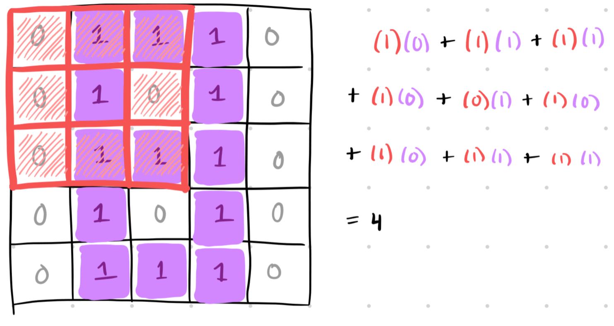
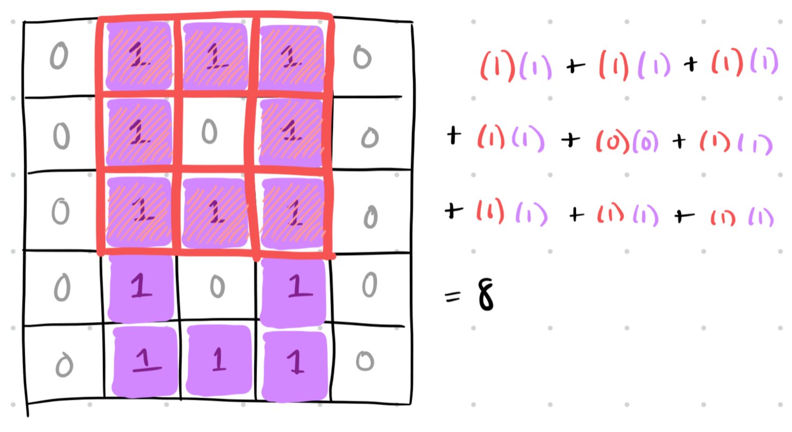
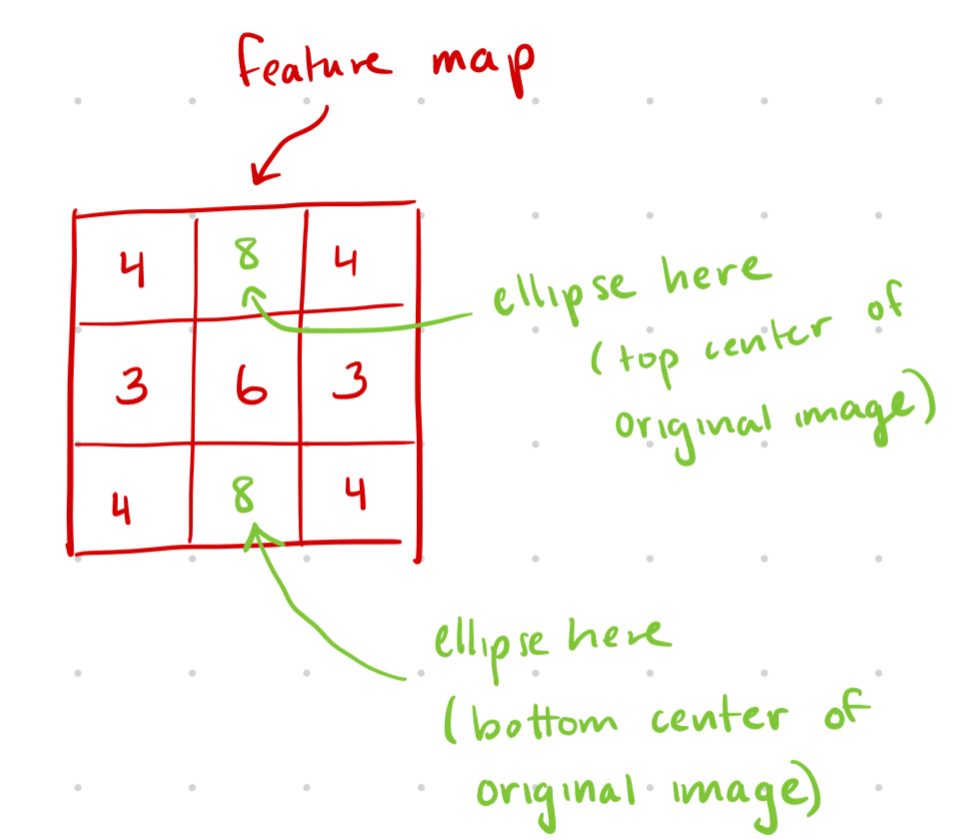
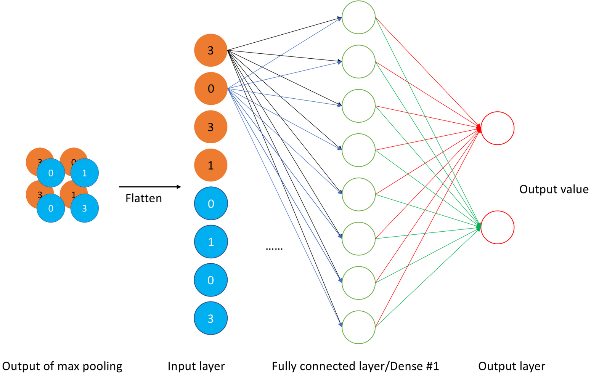

# Unit 4: Computer Vision
Hello and welcome to the _Basics_ section of the I2 megadoc! 

**Task 1:** Read the Back to Basics article to get an intuitive understanding of computer vision. **This is required.**

**Task 2:** Go through the following videos/articles and answer the provided synthesis questions. Submit your answers to your intro course TA. 
[Link to this task](https://course.uw-i2.org/megadoc/unit-04/#unit-4-synthesis-questions)

**Task 3:** Complete either the technical project or the non-technical project. Submit your work to the intro course TA.
[Link to this task](https://course.uw-i2.org/megadoc/unit-04/#unit-4-project-specs)

## Back to Basics: Computer Vision
In Week 2, we talked about how deep neural networks work on a very general level. Today, we’re going to talk about a new type of neural network, called a Convolutional Neural Network (CNN). These are neural networks that are specifically designed to process images. While neural networks resemble the way the human brain works, CNNs resemble the way the human vision system works. Often, a CNN is a subsection of a larger neural network: it’s like a group of layers that exists to process images really efficiently. 

Let’s think back to our discussion of neural networks in unit 2. Recall that we used the MNIST dataset, which contains images of handwritten numbers (here’s a picture to remind you, with [credit](https://etzold.medium.com/mnist-dataset-of-handwritten-digits-f8cf28edafe)):

    

Near the end of the article, we mentioned that as we kept training our neural network, the computer would begin to pick out patterns associated with each number (like ones usually being a straight vertical line, or zeroes being a circle). But how exactly does the computer figure that out? How does the neural network “realize” what a one, a zero, or any other number looks like? 

This is where the **convolutional layer** comes in. A CNN uses its convolutional layers to identify patterns and utilize them to analyze images. A convolutional layer would pick out the features that distinguish one number from the others. 

Recall the structure of a general neural network. 

    

Notice that every single node in the input layer is connected to every single node in the hidden layer. Remember, every node in the input layer corresponds to a pixel in the image. Our pictures of handwritten numbers contain 784 pixels (28 x 28), which means there are 784 nodes in the input layer. This means we have a lot of connections between the input layer and the first hidden layer, and the first hidden layer and the second hidden layer, and so on. 

The reason the neural network is set up like this is because it assumes that information about every pixel influences every other pixel. But that’s not necessarily true! For example, in each image in the MNIST dataset, the dark pixels tend to be close to other dark pixels, and the light pixels tend to be close to other light pixels. 

Also, the patterns associated with a given number are not exactly the same every time. Take a look at the image below ([credit](https://towardsdatascience.com/part-5-training-the-network-to-read-handwritten-digits-c2288f1a2de3)) and notice how there are slight differences in the way the numbers are written (e.g. the number 7 vs. 7 with a line through it). We need the computer to recognize that these are just variations on the exact same number. 

 
    

CNNs account for both of these things, reducing the number of input nodes and allowing for variations in the pixels when identifying features in an image. 

Now we’re going to get into how CNNs actually work, using a very simple image of a handwritten number. 

Take a look at the image below, which shows the number 8. We’ve assigned a numerical value to each pixel, like was discussed in Unit 2. 

    

The first thing a CNN does is use filters to identify the locations of features in the image. In our example, the most important feature of an 8 is an ellipse, because an 8 is made of two ellipses stacked on top of each other. So let’s use a filter to identify any ellipses in the image. At first, our filter just contains random numbers—but through backpropagation, it starts to resemble the shape of the feature we’re looking for (an ellipse). Below is an example of what the correct filter would look like. 

    

Next, we put the filter over the image and compute the **dot product** of the filter and the portion of the image that it overlaps. This involves multiplying the value in the filter by the value of the pixel underneath, and adding up all the products. 

Take a look at the example below. Notice that the feature in the filter (the ellipse) doesn’t perfectly match up with the pixels underneath it, so our dot product ends up being 4. 

    

Then, we shift our filter over by one and do the same thing. The distance by which we move our filter is called the **stride**. Notice that in this next example, the feature in the filter perfectly matches with the pixels underneath, so our dot product is much larger (8). 

    

We’ll continue shifting the filter until we’ve covered the entire image (there will probably be a lot of overlap). We keep track of all these dot products in a **feature map**. The feature map is useful because it tells us the general locations of the feature we’re tracking. Our feature map is a 3 by 3 matrix because we apply the filter nine times overall (you can try shifting the filter and calculating the dot products yourself!). 

Remember, we said that when the filter perfectly matched the pixels underneath (i.e., there was an ellipse in the image), the dot product was 8. The feature map has two 8s, which tells us that there are two ellipses in the image: in the top middle of the image and in the bottom middle of the image. This fits with what we know an 8 should look like: two ellipses stacked on top of each other! 

    

The entire process we just did, of converting an image into a feature map, is called a **convolution**.

The image we’re using, again, is really simple: it only has one distinguishing feature, which is its ellipses. If our image has multiple features (e.g. multiple lines, angles, edges, curves, etc.), we would use a different feature map for each one, and do convolutions for each feature all at the same time! 

Next, we’re going to simplify this information a little bit using a strategy called **pooling**. Pooling means to reduce our feature map into an even smaller matrix that contains the most important information from each “region” of the image. Our image is a little too simple to pool any further, but below is an example of how that would work ([credit](https://paperswithcode.com/method/max-pooling)). Here, the entire top left corner is simplified to just the largest value, and so on for the other regions. This gives us a simplified understanding of the feature map overall. 

The example below uses “max pooling,” which means it takes the largest value from each region to represent the region as a whole. There are other types of pooling as well, such as “average pooling,” which takes the average of the region to represent the overall region. 

    

We repeat the convolution-pooling cycle until our feature map (or maps, if we have multiple features) is sufficiently small. Finally, we plug our resulting feature maps into a **fully connected layer**, which is like a regular old neural network. Before, all our features were analyzed independently in different convolutions. Here, we’re putting everything together and using all our collected information to classify our image. We do this by taking all of our small, pooled feature maps, flattening them into a column vector, and treating this column vector as the **input layer** to a standard neural network, which then predicts what the final image is. Take a look at the image below for an example ([credit](https://slds-lmu.github.io/seminar_nlp_ss20/convolutional-neural-networks-and-their-applications-in-nlp.html)). 

    

This was a lot of information, so please reach out to a TA if you’re having trouble with these concepts or with the homework! Since this article was very abstract and conceptual, the homework is going to be much more technically focused. 

## Unit 4 Synthesis Questions
### **Video 1:** [How Convolutional Neural Networks work](https://youtu.be/FmpDIaiMIeA?t=840) **(12 min)**
**Note:** Watch from 13:54 onward to answer the questions below. Before that is mainly review from this article (but you may find it useful to skim through, as it covers helpful math concepts!). 
### *Synthesis Questions*
* *How is backpropagation used in CNNs, and how does it differ from backpropagation in standard neural networks?*
* *What outcomes can a designer achieve from adjusting the hyperparameters or architecture of a CNN?*
* *Can you think of an example of when we can use a CNN on non-image data?*

### **Video 2:** [But what is a convolution?](https://www.youtube.com/watch?v=KuXjwB4LzSA) **(14 min)**
**Note:** Watch up to 13:42 in this video; the rest is beyond the scope of this course. 
### *Synthesis Questions*
* *What is the name for the smaller grid that convolves over a larger image?*
    * *Hint: Starts with a "k"*
* *What are some examples of what you can do to images if you convolve them with special matrices?*
* *How does Gaussian blur "work"?*
* *What is the name for the actual operation that occurs when the smaller grid is overlaid on the larger one?*
    * *When each element of the corresponding pixels are multiplied then summed.*
* *Give an example of a 3x3 matrix that would not do anything to the image it convolves over. Why does it not impact the image?*
    * *This is also known as the "do-nothing" matrix*

## Unit 4 Project Specs
### **Technical Project Spec:**

The project for this “_Computer Vision_” section will be following the tutorial/Jupyter Notebook below. Please ask questions in the discord as you work through this project. Be sure to discuss with others in your group!

A few general helpful tips (if applicable):
* Be sure to appropriately make a copy of the Colab template before starting to save your progress!
* Renaming your copy to something that contains your name is a good idea, it will make it easier for us to review your submissions.
* Leave comments to cement your understanding. Link syntax to ideas.
* **Read up on what [CIFAR-10](https://en.wikipedia.org/wiki/CIFAR-10) is.**

Now, follow the instructions on this Jupyter notebook to implement some of the things we talked about. There is an "answers" link at the bottom of the notebook that you can use if stuck. You will need to download the '.ipynb' found in that directory and open it either locally or in a new colab project yourself. Ask around if you are unable to get it working!

**Colab Link:** [Unit 4 Notebook](https://colab.research.google.com/drive/1kvPA3EyFvmG4pknRY2uY9ZYs_cIBL2WF?usp=sharing) **(1 hr)**

When you are finished with your code, independently verify that it works and have fun with it! If you add any additional functionality be sure to talk about it with others and give them ideas.

Remember that this is all for your learning, so do your best and don’t stress!

Congratulations! You now understand the basics of Convolutional Neural networks!

### **Non-Technical Project Spec:**

The non-technical project for this unit will involve some writing! **Choose 3** of the prompts below and write **at least 200** (_meaningful!_) words on each one! We will not be strictly grading you on correctness or anything like that. This is an opportunity to deeply engage with the material you have just learned about, and creatively connect it to neuroscience!

* How are CNNs inspired by the human visual system?
* What are some similarities and differences between CNNs and the human visual system?
* How is the pooling layer in CNNs related to the brain's visual processing?
* What ways does the convolutional layer in CNNs resemble the receptive field in the visual system?
* Reflecting on you have learned from this unit, what is one thing you found to be most interesting?
* What is one concept from this unit that you would like to learn more about and why?

Be sure to submit your work through google drive using the submission form!
We would prefer that you upload it to your own Drive first, then use the submission form dropbox to connect that file to your submission!

# Old Course Content
Hello and welcome to the _Computer Vision (CV)_ section of the I2 megadoc! This section is, due to time constraints, only a very cursory glance at the foundations of CV. This is a whole subfield of ML and even if we spent 10 weeks on it, we wouldn’t scratch the surface!

Let’s start with some motivation. When you look at an image of (for example) a soda can, it does not matter where in the image the soda can is. You are able to detect it and know where it is. This detection ability is called _translational invariance_. You are able to detect an object even if it has been translated within an image. Traditional DNNs cannot do this (without being heavily overparameterized). Take a second to think about why the architecture of a DNN does not implicitly allow for translationally invariant object classification.

* (Hint: Think about how different the vectorized images would be between the soda can image and its translated invariant. The inputs to the DNN would be drastically different and it would be hard to find any pattern!)

Convolutional Neural Networks (or CNNs) solve this problem and much more. To understand what a CNN is though, you must first understand what a convolution is!

**Task:** Watch and understand the following videos. We recommend taking notes and being able to answer the synthesis questions provided below. Send your I2 teacher/mentor/overlord the answers to the questions over Discord. **Watch up to 13:42 in the video, anything after that is extra information not needed for Deep Learning.**

**Video:** [But what is a convolution?](https://www.youtube.com/watch?v=KuXjwB4LzSA) **(13 min)**

### `Synthesis Questions:`

* `What is the name for the smaller grid that convolves over a larger image?`
    * `Hint: Starts with a "k"`
* `What are some examples of what you can do to images if you convolve them with special matrices?`
* `How does Gaussian blur "work"?`
* `What is the name for the actual operation that occurs when the smaller grid is overlaid on the larger one?`
    * `When each element of the corresponding pixels are multiplied then summed.`
* `Give an example of a 3x3 matrix that would not do anything to the image it convolves over. Why does it not impact the image?`
    * `This is also known as the "do-nothing" matrix`

Awesome job! Now we move onto integrating the concept of a convolution into a neural network.

**Task:** Read the following article, watch the video, and answer the synthesis questions:

**Article:** [Comprehensive CNN Guide](https://towardsdatascience.com/a-comprehensive-guide-to-convolutional-neural-networks-the-eli5-way-3bd2b1164a53) **(15 min)**

**Video:** [Visualizing Convolutional Neural Networks \| Layer by Layer](https://www.youtube.com/watch?v=JboZfxUjLSk) **(5 min)**

### `Synthesis Questions:`

* `The architecture of a CNN is loosely based on what part of the brain?`
* `What is stride length?`
* `What is padding?`
    * `Why is padding useful?`
* `What is the objective of the convolutional layer in a CNN?`
* `What is the purpose of the pooling layer in a CNN?`
    * `What are the two ways to pool shown to you in the article?`
* `What is flattening and when is it done in a CNN?`
* `What is the purpose of the feedforward layer in a CNN?`
* `How do the convolutional layers before the feedforward layer in a CNN allow for higher accuracy?`

We have introduced you to the idea of a convolution and how convolutions are applied in CNNs. Can you begin to see how convolutions help with _translational invariance_? Think about it for a bit! Before the project, we just want to expose you to a few different types of convolutions. They aren’t all the same and serve different purposes.

## Self-Supervised Learning

Human and machines learn in very different ways; think about how you learn new information vs how you gain new experience vs how toddlers learn. Therefore, it is important for us to understand and research different learning approaches. Read the articles listed below and answer the synthesis questions. Don't focus too much on the math and implementation, focus on getting an intuition. Optionally, watch the video (interview clip) and slides and notebook on variational autoencoders.

**Video (optional):** [Yann LeCun: Self-Supervised Learning Explained](https://youtu.be/JNiY0RXxFZY?si=v6YQODX92aGG2iVs) **(10 min)**

**Article:** [Self-Supervised Learning: Definition, Tutorial & Examples](https://www.v7labs.com/blog/self-supervised-learning-guide) **(15 min)**

**Article:** [Image De-noising Using Deep Learning – Towards AI](https://towardsai.net/p/deep-learning/image-de-noising-using-deep-learning) **(15 min)**

**Article:** [The brain may learn about the world the same way some computational models do](https://news.mit.edu/2023/brain-self-supervised-computational-models-1030) **(5 min)**

**Variational Autoencoder (optional):** [Variational Autoencoders JC Slides](https://docs.google.com/presentation/d/1KTb7wxnsBryuar-yB-AVrizw88Wc3Vue46iCwmN0558/edit#slide=id.p), [Notebook](https://colab.research.google.com/drive/1jpSFaB0UKYJFQ1COsPk6Gbz6frEPyU8X?usp=drive_link)

### `Synthesis Questions:`

* `In short, what is self-supervised learning?`
* `What are some short comings of supervised and reinforcement learning?`
  * `Consider training requirements: data, compute, etc`
  * `And how does self-supervised learning overcome/mitigate these limitations?`
* `How is self-supervised learning similar to human's learning process?`
* `How do you think self-supervised learning can be applied to image denoising?`
* `Why do you (or do you not) think self-supervised learning is meaningful?`

## Semantic Segmentation

Our goal with vanilla CNNs was to classify whole images. However, a single image can contain many different objects in different locations. In semantic segmentation, we identify both what is inside an image and where those things are in the image. This is done by classifying each pixel according to pre-defined categories. The first successful architecture for semantic segmentation is U-net. Watch the video below for a high-level understanding of U-net and read the article for more details.

**Video:** https://www.youtube.com/watch?v=NhdzGfB1q74
**Article:** https://www.jeremyjordan.me/semantic-segmentation/

### `Synthesis Questions:`

* `In the U-net architecture, what is the purpose of the downsampling step? What about the upsampling step? Why do skip connections improve the network’s performance?`
* `Compare semantic segmentation with human vision. What capabilities could be added to a semantic segmentation model to make it more human-like?`

---

# **Technical Project Spec:**

The project for this “_Computer Vision_” section will be following the tutorial/Jupyter Notebook below. Please ask questions in the discord as you work through this project. Be sure to discuss with others in your group!

A few general helpful tips (if applicable):
* Be sure to appropriately make a copy of the Colab template before starting to save your progress!
* Renaming your copy to something that contains your name is a good idea, it will make it easier for us to review your submissions.
* Leave comments to cement your understanding. Link syntax to ideas.
* **Read up on what [CIFAR-10](https://en.wikipedia.org/wiki/CIFAR-10) is.**

Now, follow the instructions on this Jupyter notebook to implement some of the things we talked about. There is an "answers" link at the bottom of the notebook that you can use if stuck. You will need to download the '.ipynb' found in that directory and open it either locally or in a new colab project yourself. Ask around if you are unable to get it working!

**Colab Link:** [Unit 4 Notebook](https://colab.research.google.com/drive/1kvPA3EyFvmG4pknRY2uY9ZYs_cIBL2WF?usp=sharing) **(1 hr)**

When you are finished with your code, independently verify that it works and have fun with it! If you add any additional functionality be sure to talk about it with others and give them ideas.

Remember that this is all for your learning, so do your best and don’t stress!

Congratulations! You now understand the basics of Convolutional Neural networks!

# **Non-Technical Project Spec:**

The non-technical project for this unit will involve some writing! **Choose 3** of the prompts below and write **at least 200** (_meaningful!_) words on each one! We will not be strictly grading you on correctness or anything like that. This is an opportunity to deeply engage with the material you have just learned about, and creatively connect it to neuroscience!

* How are CNNs inspired by the human visual system?
* What are some similarities and differences between CNNs and the human visual system?
* How is the pooling layer in CNNs related to the brain's visual processing?
* What ways does the convolutional layer in CNNs resemble the receptive field in the visual system?
* Reflecting on you have learned from this unit, what is one thing you found to be most interesting?
* What is one concept from this unit that you would like to learn more about and why?

Be sure to submit your work through google drive using the submission form!
We would prefer that you upload it to your own Drive first, then use the submission form dropbox to connect that file to your submission!
